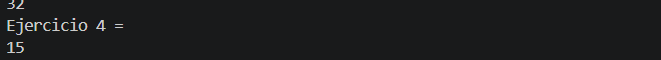

# Universidad Politecnica Salesiana

## Estructura de datos

# Estudiante: Martin Amaya

Practica Recursividad

Fecha: 11/05/2026

Descripcion:
Se creó metodos que generan recursividad segun lo pedido en este caso sumar los digitos de un numero dado y mostrar la respuesta de la suma.
En el ejemplo e numero dado es 456 y la suma de sus
digitos es 15

### Evidencia

